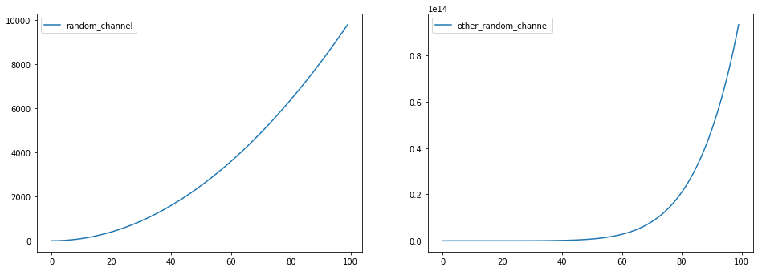

Local notebook workflow
=======================

Prerequisites
-------------

Neptune configuration file neptune.yaml
~~~~~~~~~~~~~~~~~~~~~~~~~~~~~~~~~~~~~~~

.. code:: yaml

    project: neptune-ml/Sandbox

    exclude:
      - neptune.log
      - offline_job.log
      - output
      
    parameters:
        power: 3

Offline neptune context
~~~~~~~~~~~~~~~~~~~~~~~

.. code:: ipython3

    import neptune
    
    ctx = neptune.Context()

.. parsed-literal::

    neptune: Executing in Offline Mode.

Typical Problems
----------------

Working with on neptune code in local notebooks can be tricky.

For example, normally you cannot access hyperparameters with:

.. code:: ipython3

    ctx.params

or use the ``.channel_send()`` method:

.. code:: ipython3

    ctx.channel_send('random_channel', i, 2 + i**2)

Create a local notebook Context wrapper
---------------------------------------

Fortunatelly there is a simple solution to those problems. Use the
``LocalNotebookContext`` object from the ``neptune-contrib`` package:

.. code:: ipython3

    from neptune.contrib.monitoring.notebooks import LocalNotebookContext
    ctx = NotebookContext(ctx, config_filepath='neptune.yaml') 

To instantiate it you need to pass the "normal" Neptune ``Context``
object and the path to your neptune config file.

Access ``.params``
------------------

Now your params are easily available:

.. code:: ipython3

    ctx.params

.. parsed-literal::

    AttrDict({'power': 3})

Use ``.channel_send``
---------------------

And you can monitor your numerical channels in the notebook output with
no problems!

.. code:: ipython3

    for i in range(100):
        ctx.channel_send('random_channel', i, 2 + i**2)
        ctx.channel_send('other_random_channel', y=5 + i**7)
        ctx.channel_send('text_channel','blabla')

Run your local Notebook in Neptune
----------------------------------

Once you are finished developing your model and you can run your
notebook in a top-to-bottom manner you can switch to running "normal"
neptune job.

Convert to ``.py`` and run
~~~~~~~~~~~~~~~~~~~~~~~~~~

Use ``jupyter nbconvert`` option:

.. code:: bash

    jupyter nbconvert --to script main.py; neptune run --config neptune.yaml main.py

You should get something like this:

.. figure:: https://gist.githubusercontent.com/jakubczakon/f754769a39ea6b8fa9728ede49b9165c/raw/d7395f0dfdd9b1dbe1a93ecf03dfc901071ad472/local_nb_workflow.png
   :alt: image

   image
