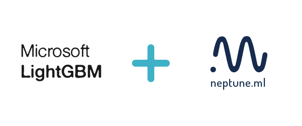
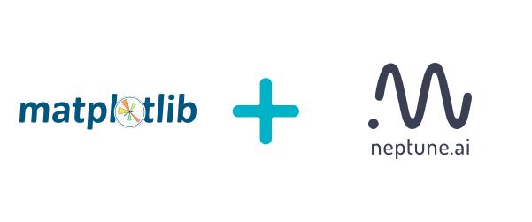

neptune-contrib: open-source contributions to Neptune.ai
========================================================

This library is a collection of helpers and extensions that make working
with `Neptune app`_ more effective and better. It is build on top of neptune-client
and gives you option to do things like:

* interactive visualizations of experiment runs or hyperparameters
* running hyper parameter sweeps in scikit-optimize, hyperopt or any other tool you like
* monitor training of the lightGBM or fastai models with a single callback
* much more

Enjoy the following integrations:

And the best thing is you can extend it yourself or... tell us to do it for you :).

.. toctree::
   :maxdepth: 1
   :caption: Get Started

   installation
   overview

.. toctree::
   :maxdepth: 1
   :caption: Examples

   examples/examples_index

.. toctree::
   :maxdepth: 1
   :caption: User Guide

   api.utils <user_guide/api/utils>
   hpo.utils <user_guide/hpo/utils>
   bots.telegram_bot <user_guide/bots/telegram_bot>
   logging.chart <user_guide/logging/chart>
   monitoring.lightgbm <user_guide/monitoring/lightgbm>
   monitoring.xgboost <user_guide/monitoring/xgboost>
   monitoring.fastai <user_guide/monitoring/fastai>
   monitoring.metrics <user_guide/monitoring/metrics>
   monitoring.fairness <user_guide/monitoring/fairness>
   monitoring.optuna <user_guide/monitoring/optuna>
   monitoring.sacred <user_guide/monitoring/sacred>
   monitoring.skopt <user_guide/monitoring/skopt>
   monitoring.utils <user_guide/monitoring/utils>
   sync.with_json <user_guide/sync/with_json>
   versioning.data <user_guide/versioning/data>
   viz.experiments <user_guide/viz/experiments>
   viz.projects <user_guide/viz/projects>
   viz.parallel_coordinates_plot <user_guide/viz/parallel_coordinates_plot>

Bug Reports and Questions
-------------------------

neptune-contrib is MIT-licensed and the source code is available on `GitHub`_. If you
find yourself in any trouble drop an isse on `Git Issues`_, fire a feature request on
`Git Feature Request`_ or ask us on the `Neptune community forum`_ or `Neptune community spectrum`_.

Contribute
----------

We keep an updated list of open issues/feature ideas on github project page `Github projects`_.
If you feel like taking a shot at one of those do go for it!
In case of any trouble please talk to us on the `Neptune community spectrum`_.

Indices and tables
------------------

* :ref:`genindex`
* :ref:`modindex`

.. _GitHub: https://github.com/neptune-ai/neptune-contrib
.. _Git Issues: https://github.com/neptune-ai/neptune-contrib/issues
.. _Git Feature Request: https://github.com/neptune-ai/neptune-contrib/issues
.. _Neptune app: https://neptune.ai/
.. _Neptune community forum: https://community.neptune.ai/
.. _Github projects: https://github.com/neptune-ai/neptune-contrib/projects
.. _Neptune community spectrum: https://spectrum.chat/neptune-community?tab=posts
