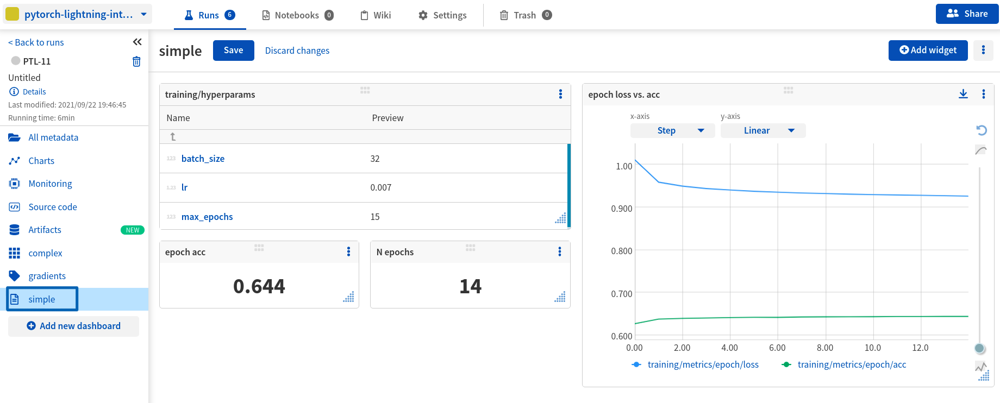

Neptune Legacy Logger for PyTorch Lightning
===========================================

This library is a location of the ``NeptuneLegacyLogger`` for PyTorch Lightning.

.. warning::
    This is LegacyLogger implementation that is under maintenance support only.
    No new updates will be made to this logger.

    **Please visit integration**
    ** `docs <https://docs.neptune.ai/integrations-and-supported-tools/model-training/pytorch-lightning>`_ **
    **to learn about the latest, fully supported version.**

Installation
------------

Install neptune-contrib via pip:

.. code-block:: bash

    pip install neptune-contrib

or

.. code-block:: bash

    pip install neptune-contrib[monitoring]

.. toctree::
   :maxdepth: 1
   :caption: Reference

   PyTorch Lightning <user_guide/monitoring/pytorch_lightning>

Bug Reports and Questions
-------------------------
If you found yourself in any trouble drop an issue on `Git Issues`_.

.. warning::
    This is LegacyLogger implementation that is under maintenance support only.
    No new updates will be made to this logger.

    **Please visit integration**
    ** `docs <https://docs.neptune.ai/integrations-and-supported-tools/model-training/pytorch-lightning>`_ **
    **to learn about the latest, fully supported version.**

Indices and tables
------------------

* :ref:`genindex`
* :ref:`modindex`

.. _GitHub: https://github.com/neptune-ai/neptune-contrib
.. _Git Issues: https://github.com/neptune-ai/neptune-contrib/issues
